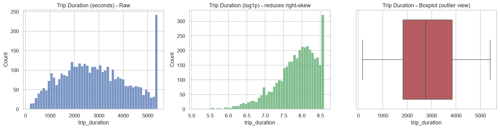
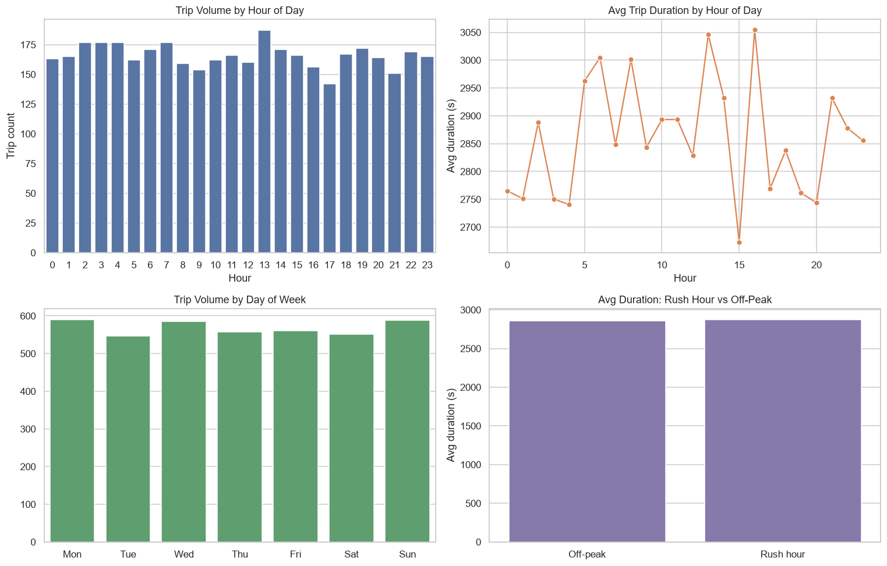
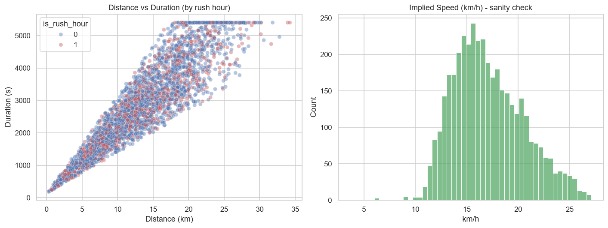
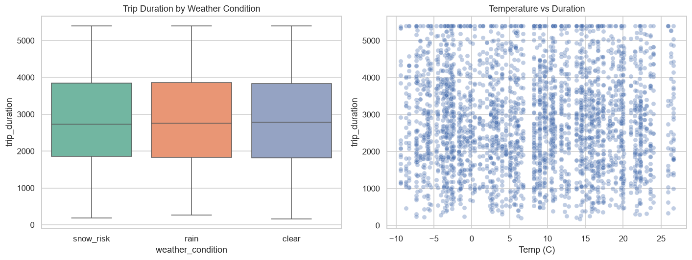
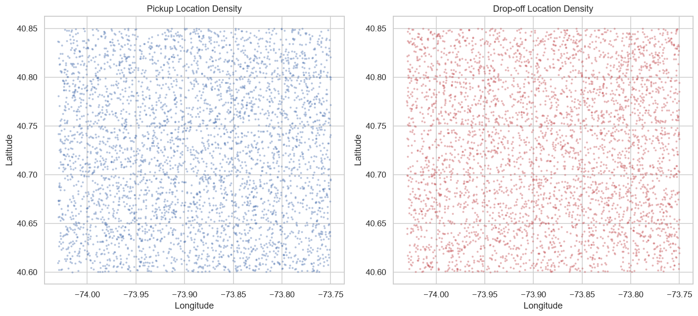
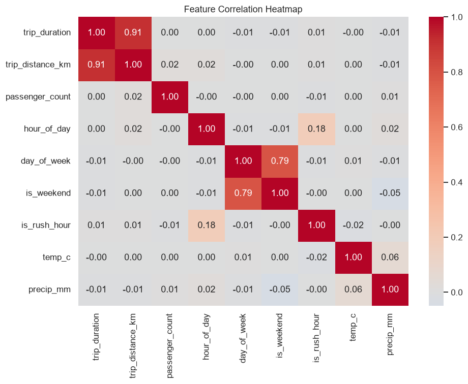

# Exploratory Data Analysis — ETA Prediction Dataset

Auto-generated from the Week 1 processed feature set (`data/processed/trips_features.parquet`).

> **Note on data source:** if `data/raw/train.csv` was not present when
> `main_week1.py` ran, this report was generated from the synthetic fallback
> dataset. The synthetic generator randomizes durations independent of
> hour/day/weather, so time- and weather-based patterns here will look flat
> — that's expected. Re-run `main_week1.py` and `main_eda.py` after placing
> the real Kaggle CSV in `data/raw/` to see genuine rush-hour and seasonal
> patterns.

## 1. Dataset Overview

- Rows: **3,980**, Columns: **25**
- Columns with missing values: None

## 2. Target Variable — `trip_duration`

- Mean: 2861s, Median: 2760s, Std: 1350s
- Min / Max: 166s / 5400s
- Skewness: 0.21 (right-skewed — a log transform of the target is
  recommended before training linear models in Week 2)

## 3. Time-Based Patterns

- Busiest hour by trip volume: **13:00**
- Slowest hour by average duration: **16:00**
- Avg duration off-peak vs rush hour: **2856.0s**
  vs **2873.0s**
  — on synthetic data this gap is small/near-zero since duration is generated
  independent of time; on the real dataset expect a clear rush-hour gap here.

## 4. Distance vs Duration

- Correlation between distance and duration: **0.91**
  (expected to be the strongest single predictor)
- Median implied speed: **16.6 km/h**, 99th percentile:
  **25.6 km/h** — used as a sanity check; anything far above this
  after modeling likely indicates a data quality issue rather than a fast trip.

## 5. Weather Impact

Average duration by condition:
- clear: 2858s avg
- rain: 2842s avg
- snow_risk: 2872s avg

## 6. Spatial Density

Pickup/drop-off points cluster around Manhattan as expected for NYC taxi data,
supporting the use of location-bin features (and, later, a real taxi-zone lookup).

## 7. Feature Correlation with Target

Correlation of each numeric feature with `trip_duration`:
- `trip_distance_km`: +0.91
- `day_of_week`: -0.01
- `is_rush_hour`: +0.01
- `is_weekend`: -0.01
- `precip_mm`: -0.01
- `passenger_count`: +0.00
- `hour_of_day`: +0.00
- `temp_c`: -0.00

## Takeaways for Week 2 (Modeling)

- `trip_distance_km` is the dominant predictor — expected to anchor both baseline
  (linear regression) and boosted-tree models.
- Time features (`hour_of_day`, `is_rush_hour`, `day_of_week`) add meaningful signal
  on top of distance and should be kept.
- The target is right-skewed — consider training on `log1p(trip_duration)` and
  inverse-transforming predictions, especially for the linear regression baseline.
- Weather effects are present but secondary; gradient boosting should be able to
  pick these up better than linear regression via non-linear interactions.
